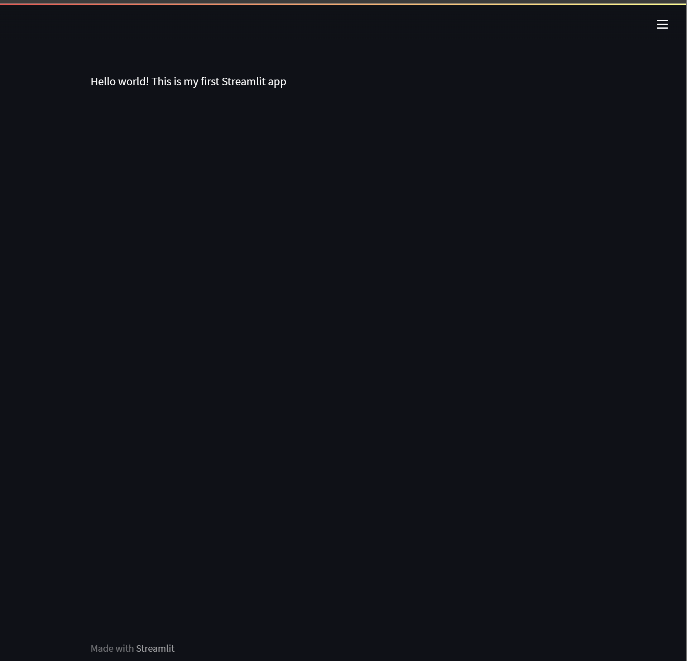

# Day 2 of Streamlit

Building our first Streamlit app

1. Create an app file

        code streamlit_app.py

2. Code your first line

        import streamlit as st
        
        st.write("Hello world! This is my first Streamlit app")
    
    Click save file

3. Run your first Streamlit app

        streamlit run day2_app.py
        
We will see the app running on 

        You can now view your Streamlit app in your browser.
        
        Local URL: http://localhost:8501
        Network URL: http://172.25.166.161:8501

## Yay! Here is my first app

> **Tip** - press `Ctrl + c` to stop the app

        Stopping...

Our terminal returned.